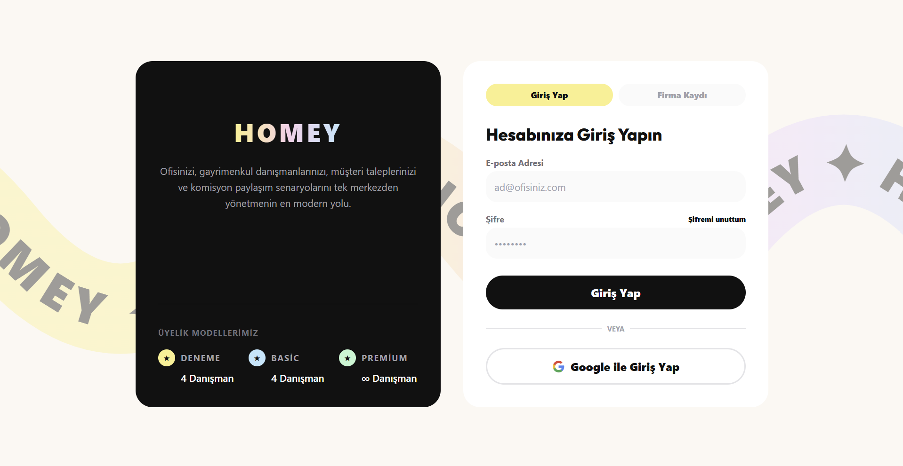

# HOMEY - Emlak Yönetim ve CRM Sistemi

🌐 **Canlı Demo:** Projemizi [homey.irmaksuvari.me](https://homey.irmaksuvari.me) adresinden canlı olarak inceleyebilirsiniz.

HOMEY, gayrimenkul danışmanlarının ve emlak ofislerinin günlük operasyonlarını (portföy yönetimi, müşteri takibi, evrak işleri) dijitalleştirerek tek bir merkezden, hızlı ve hatasız bir şekilde yönetmelerini sağlamak amacıyla geliştirilmiş modern bir **SaaS (Software as a Service)** çözümüdür.

## 🌟 Vizyon ve Misyon
* **Misyon:** Emlak sektöründeki profesyonellere zaman kazandıran, süreç karmaşasını ortadan kaldıran, teknolojik, güvenli ve kullanıcı odaklı bir dijital altyapı sunmak.
* **Vizyon:** Sektör standartlarını yükselterek, gayrimenkul alım-satım ve kiralama süreçlerindeki geleneksel hantal yapıları tamamen modernleştiren lider prop-tech (property technology) platformu olmak.

## 🚀 Kullanılan Teknolojiler
Uygulamamız, yüksek performans ve güvenlik standartlarını karşılamak üzere modern teknolojilerle inşa edilmiştir:

* **Frontend (Arayüz):** React, TypeScript, Tailwind CSS, Vite
* **Backend (Sunucu):** Node.js, Express, TypeScript, MongoDB
* **Entegrasyonlar:** 
  * Google OAuth (Giriş Sistemi)
  * Azure Storage Blob (Dosya ve Fotoğraf Yönetimi)
  * Resend (E-posta bildirimleri)
  * React-Leaflet (Harita Altyapısı)

## ✨ Kullanıcı Dostu Özellikler
* **Google ile Tek Tıkla Giriş:** Karmaşık kayıt formlarıyla uğraşmadan, Google hesabınızla saniyeler içinde güvenle sisteme dahil olabilirsiniz.
* **Karanlık Mod (Dark Mode) ve Modern Tasarım:** Gece kullanımlarında göz yormayan, şık "Glassmorphism" tasarıma sahip modern tema seçeneği.
* **Dinamik Haritalandırma:** Portföylerin coğrafi dağılımını interaktif harita üzerinde görselleştirerek hızlı lokasyon analizi yapma imkanı.
* **Hızlı Şifre Sıfırlama ve Değiştirme:** Unutulan şifreleri e-posta üzerinden anında ve güvenle yenileyebilme, profil içerisinden kolayca değiştirebilme altyapısı.
* **Kesintisiz Deneyim:** Akıcı mikro animasyonlar, hızlı filtreleme panelleri ve hata durumlarında kullanıcıyı yönlendiren bilgilendirici pop-up'lar (toast mesajları).

## 📱 Modüller ve Sayfa Akışları

### Genel Kullanım Sayfaları
* **Dashboard (Ana Kontrol Paneli):** Aktif portföy sayınız, hedeflenen satış oranlarınız ve portföylerin toplam değeri gibi ana metrikleri sunar. Ekibinizin güncel faaliyetlerini anlık olarak takip edebilirsiniz.
* **Portföyler (İlanlar):** Tüm satılık ve kiralık ilanların görsel, lokasyon ve fiyat bilgileri. Yeni mülk ekleme, fotoğraf yükleme ve durum değişiklikleri buradan yapılır.
* **Tamamlanan İşlemler:** Evrak süreçleri bitip kapatılan portföylerin arşivlendiği ve geriye dönük ciro hesaplamalarının yapıldığı sayfadır.
* **Harita:** Tüm gayrimenkullerinizi kuş bakışı gösteren interaktif harita ekranı.
* **Müşteriler:** Tüm alıcı, satıcı, kiracı ve mal sahiplerinin iletişim ve talep bilgilerinin tutulduğu rehberdir.
* **Randevular:** Müşterilerle yapılacak yer gösterme etkinliklerinin takvim üzerinden yönetildiği alandır.
* **Süreç Yönetimi:** Portföylerin pazarlama aşamasından anahtar teslimine kadar geçen evrelerinin yönetildiği (Kanban tarzı) sayfadır.
* **Evrak İşlemleri:** Satış/Kiralama aşamasında hazır Kira Kontratı veya Tahliye Taahhütnamesi indirilip müşteriye onaylatıldığı modüldür.
* **Hesaplama Araçları:** Konut kredisi faizi hesaplama, aylık taksit belirleme, tapu harcı hesaplama gibi pratik araçlar.

### Yönetici (Admin Only) Sayfaları
* **Ciro & Performans:** Ekipler arası ciro yarışları incelenir, ofisin büyüme trendi ve ofis genel durumu için detaylı analitik raporlar çıkarılır.
* **Ekip Yönetimi:** Emlak ofisindeki broker ve danışman ekibinin yönetildiği yerdir. Yeni danışman davet edilir ve yetkileri düzenlenir.
* **Lisans & Abonelik:** SaaS paket planının (paket yükseltme, yenileme) yönetildiği sekmedir.
* **Komisyon Ayarları:** Ofis içi ve dışı komisyon paylaşım standartlarının belirlendiği alan.
* **Firma Evrakları:** Tema rengi, ofis logosu/ismi güncellemesi yapılır. Ofise özel standart şablonlar (Firma Evrakları) sisteme yüklenir.

## 🛠️ Kurulum ve Erişim
Projeyi yerel ortamınızda çalıştırmak için:

1. Depoyu bilgisayarınıza klonlayın.
2. `frontend` ve `backend` klasörlerinde sırasıyla `npm install` komutu ile bağımlılıkları yükleyin.
3. Çevresel değişkenlerinizi (`.env` dosyaları) ayarlayın.
4. Geliştirme ortamını başlatmak için `npm run dev` komutunu kullanın (Frontend için varsayılan: `http://localhost:3000`).

---
*Daha fazla detay ve arayüz görselleri için docs klasörü içerisindeki [HOMEY_RAPOR2.pdf](./HOMEY_RAPOR2.pdf) dosyasını inceleyebilirsiniz.*
