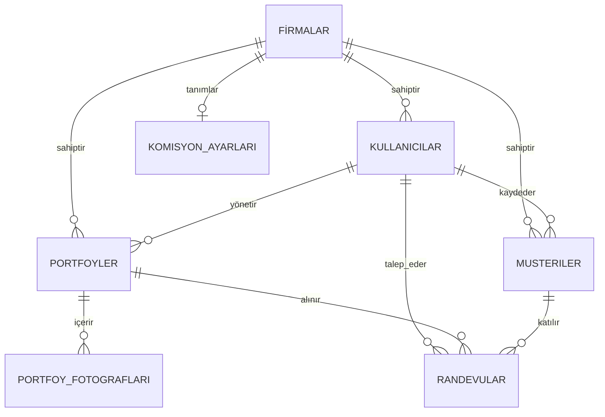
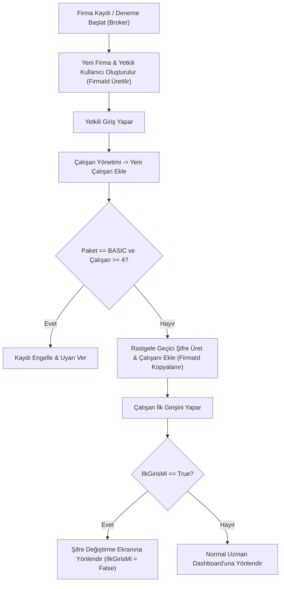
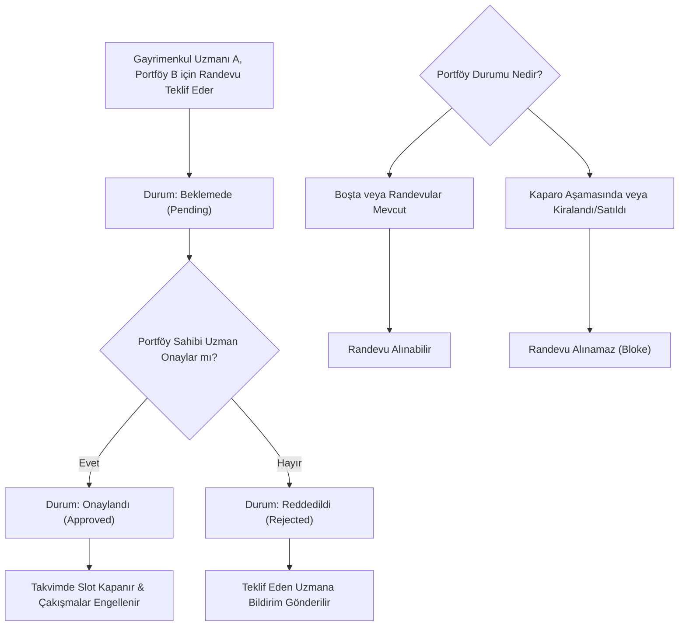

# HOMEY Startup Yol Haritası (Roadmap) ve Teknik Mimari Kılavuzu

Bu belge, **HOMEY** emlak SaaS platformunun hayata geçirilmesi sürecinde size rehberlik etmek amacıyla hazırlanmış detaylı bir teknik yol haritası ve mimari kılavuzdur. Projede kullanılacak veritabanı şemaları, abonelik kontrolleri, komisyon hesaplama mantığı, randevu iş akışları ve adım adım geliştirme aşamaları aşağıda detaylandırılmıştır.

---

## 1. Sistem Mimarisi ve Teknoloji Yığın Önerisi

HOMEY projesinin ölçeklenebilir, güvenli ve modern bir SaaS (Multi-tenant) yapıda olması için önerilen teknoloji yığını:

*   **Frontend (Arayüz):** Next.js (React) veya Vite + React. Modern, hızlı ve SEO uyumlu bir kullanıcı deneyimi için. Tasarımda modern fontlar (örneğin Google Fonts'tan *Inter* veya *Outfit*), sleek dark mode, yumuşak geçişler ve micro-animation'lar kullanılmalıdır.
*   **Backend (API):** ASP.NET Core Web API veya Node.js (NestJS / Express). Azure SQL ve Azure hizmetleriyle en uyumlu ve performanslı entegrasyon için **ASP.NET Core** veya **Node.js** güçlü tercihlerdir.
*   **Veritabanı:** Azure SQL Database (İlişkisel veriler, yetkilendirmeler, komisyon oranları ve işlemler için).
*   **Dosya Depolama (Storage):** Azure Blob Storage (Portföy fotoğrafları ve sözleşme şablonları için). DB şişmesini önlemek amacıyla fotoğraflar buraya yüklenecek ve DB'de yalnızca URL'leri saklanacaktır.
*   **Kimlik Doğrulama & JWT:** Tenant-ID (FirmaId) tabanlı JWT (JSON Web Token) kimlik doğrulama yapısı.

---

## 2. Veritabanı Şeması (Azure SQL DB)

Aşağıdaki veritabanı tasarımı, tenant (firma) izolasyonunu, çalışan limitlerini, komisyon oranlarını ve randevu durumlarını destekleyecek şekilde tasarlanmıştır.



### Tablo Detayları

#### 1. Firmalar (Tenants)
Firmaların abonelik paketlerini ve faturalandırma dönemlerini yöneten tablodur.
| Kolon Adı | Veri Tipi | Açıklama |
| :--- | :--- | :--- |
| `Id` | `UNIQUEIDENTIFIER` (PK) | Firmanın benzersiz kimliği (Tenant ID). |
| `FirmaAdi` | `VARCHAR(150)` | Firma ticari adı (Örn: Körfez Emlak). |
| `VergiNo` | `VARCHAR(50)` | Firmanın vergi numarası. |
| `Sehir` | `VARCHAR(100)` | Firmanın bulunduğu şehir. |
| `PaketTipi` | `VARCHAR(20)` | `DENEME`, `BASIC`, `PREMIUM` değerlerini alır. |
| `AbonelikTipi` | `VARCHAR(20)` | `AYLIK`, `YILLIK` değerlerini alır. |
| `AbonelikBitisTarihi`| `DATETIME` | Aboneliğin sona ereceği tarih. |
| `KayitTarihi` | `DATETIME` | Firmanın sisteme kayıt tarihi. |

#### 2. Kullanicilar (Users)
Broker'lar (Yetkili) ve Gayrimenkul Uzmanları (Çalışan) bu tabloda tutulur.
| Kolon Adı | Veri Tipi | Açıklama |
| :--- | :--- | :--- |
| `Id` | `UNIQUEIDENTIFIER` (PK) | Kullanıcının benzersiz kimliği. |
| `FirmaId` | `UNIQUEIDENTIFIER` (FK) | `Firmalar.Id` ile ilişkilidir. |
| `Ad` | `VARCHAR(100)` | Kullanıcının adı. |
| `Soyad` | `VARCHAR(100)` | Kullanıcının soyadı. |
| `Eposta` | `VARCHAR(150)` (Unique) | Giriş için kullanılacak e-posta adresi. |
| `SifreHash` | `VARCHAR(256)` | Güvenli hash'lenmiş şifre. |
| `Telefon` | `VARCHAR(20)` | Kullanıcının telefon numarası. |
| `Rol` | `VARCHAR(20)` | `YETKILI` (Broker) veya `UZMAN` (Agent). |
| `IlkGirisMi` | `BIT` | Varsayılan `1` (True). İlk girişte şifre değiştirme zorunluluğu için. |
| `AktifMi` | `BIT` | Çalışanın aktif/pasif durumu. |
| `KayitTarihi` | `DATETIME` | Kullanıcının kayıt tarihi. |

#### 3. Musteriler (Clients)
Gayrimenkul uzmanlarının kendi portföylerine veya randevularına bağlayabileceği müşteri (alıcı adayı) tablosudur.
| Kolon Adı | Veri Tipi | Açıklama |
| :--- | :--- | :--- |
| `Id` | `UNIQUEIDENTIFIER` (PK) | Müşterinin benzersiz kimliği. |
| `FirmaId` | `UNIQUEIDENTIFIER` (FK) | `Firmalar.Id` ile ilişkilidir (Tenant izolasyonu). |
| `KayitEdenUzmanId`| `UNIQUEIDENTIFIER` (FK) | `Kullanicilar.Id` ile ilişkilidir. |
| `Ad` | `VARCHAR(100)` | Müşterinin adı. |
| `Soyad` | `VARCHAR(100)` | Müşterinin soyadı. |
| `Telefon` | `VARCHAR(20)` | Müşterinin telefon numarası. |
| `AradigiButce` | `DECIMAL(18,2)` | Aradığı maksimum bütçe tutarı. |
| `AradigiEmlakTipi`| `VARCHAR(50)` | Tercih ettiği emlak tipi. |
| `KayitTarihi` | `DATETIME` | Müşterinin sisteme kayıt tarihi. |

#### 4. Portfoyler (Properties)
Gayrimenkul portföylerinin tüm detaylarını içeren ana tablodur.
| Kolon Adı | Veri Tipi | Açıklama |
| :--- | :--- | :--- |
| `Id` | `UNIQUEIDENTIFIER` (PK) | Portföyün benzersiz kimliği. |
| `FirmaId` | `UNIQUEIDENTIFIER` (FK) | `Firmalar.Id` ile ilişkilidir (Tenant izolasyonu). |
| `GorevliUzmanId`| `UNIQUEIDENTIFIER` (FK) | `Kullanicilar.Id` (Portföy sahibi emlakçı). |
| `Tip` | `VARCHAR(30)` | `MUSTAKIL`, `VILLA`, `DAIRE`, `ARSA` |
| `Tur` | `VARCHAR(20)` | `KIRALIK`, `SATILIK` |
| `Fiyat` | `DECIMAL(18,2)` | Portföyün satış veya kiralama bedeli. |
| `KaparoMiktari` | `DECIMAL(18,2)` | Alınan/istenen kaparo miktarı. |
| `DepozitoMiktari`| `DECIMAL(18,2)` | İstenen depozito miktarı. |
| `Il` / `Ilce` | `VARCHAR(50)` | Adres il ve ilçe bilgileri. |
| `Semt` / `Mahalle` | `VARCHAR(100)` | Adres semt ve mahalle bilgileri. |
| `Cadde` / `Sokak` | `VARCHAR(100)` | Adres cadde ve sokak detayları. |
| `EvSahibiAdi` | `VARCHAR(150)` | *Kritik Veri:* Yalnızca Yetkili ve görevli uzman görebilir. |
| `EvSahibiTelefon`| `VARCHAR(20)` | *Kritik Veri:* Yalnızca Yetkili ve görevli uzman görebilir. |
| `Durum` | `VARCHAR(30)` | `BOSTA`, `RANDEVULAR_MEVCUT`, `KAPARO_ASAMASINDA`, `KIRALANDI_SATILDI` |
| `KayitTarihi` | `DATETIME` | Portföyün sisteme giriş tarihi. |

#### 5. PortfoyFotograflari (Property Photos)
Azure Blob Storage'a yüklenen fotoğrafların URL'lerini tutan alt tablodur.
| Kolon Adı | Veri Tipi | Açıklama |
| :--- | :--- | :--- |
| `Id` | `UNIQUEIDENTIFIER` (PK) | Fotoğrafın benzersiz kimliği. |
| `PortfoyId` | `UNIQUEIDENTIFIER` (FK) | `Portfoyler.Id` ile ilişkilidir. |
| `FotoUrl` | `VARCHAR(500)` | Azure Blob Storage üzerindeki dosya URL'si. |
| `Sira` | `INT` | Fotoğrafların listelenme sırası (vitrin fotoğrafı vb.). |

#### 6. KomisyonAyarlari (Commission Settings)
Yetkili (Broker) tarafından her firma bazında tanımlanan ve dinamik hesaplamalarda kullanılan oranlar tablosudur.
| Kolon Adı | Veri Tipi | Açıklama |
| :--- | :--- | :--- |
| `FirmaId` | `UNIQUEIDENTIFIER` (PK, FK)| Her firmanın kendine özel tek bir ayar satırı olur. |
| `SenaryoA_OfisYuzde` | `DECIMAL(5,2)` | Senaryo A için ofisin alacağı yüzde (Örn: 40.00). |
| `SenaryoA_DanismanYuzde` | `DECIMAL(5,2)` | Senaryo A için danışmanın alacağı yüzde (Örn: 60.00). |
| `SenaryoB_OfisYuzde` | `DECIMAL(5,2)` | Senaryo B için ofis payı yüzdesi. |
| `SenaryoB_PortfoySahibiYuzde`| `DECIMAL(5,2)` | Senaryo B için portföy sahibi uzman payı yüzdesi. |
| `SenaryoB_MusteriGetirenYuzde`| `DECIMAL(5,2)` | Senaryo B için müşteriyi getiren uzman payı yüzdesi. |
| `SenaryoC_DisOrtakYuzde` | `DECIMAL(5,2)` | Senaryo C için dış emlakçı payı (Varsayılan: 50.00). |
| `SenaryoC_OfisYuzde` | `DECIMAL(5,2)` | Senaryo C'de kalan %50 içindeki ofis payı yüzdesi. |
| `SenaryoC_DanismanYuzde` | `DECIMAL(5,2)` | Senaryo C'de kalan %50 içindeki danışman payı yüzdesi. |

#### 7. Randevular (Appointments)
Gayrimenkul uzmanlarının birbirlerinin portföyleri için talep ettiği randevular.
| Kolon Adı | Veri Tipi | Açıklama |
| :--- | :--- | :--- |
| `Id` | `UNIQUEIDENTIFIER` (PK) | Randevunun benzersiz kimliği. |
| `PortfoyId` | `UNIQUEIDENTIFIER` (FK) | `Portfoyler.Id` ile ilişkilidir. |
| `TeklifEdenUzmanId`| `UNIQUEIDENTIFIER` (FK) | Randevuyu talep eden gayrimenkul uzmanı. |
| `MusteriId` | `UNIQUEIDENTIFIER` (FK) | `Musteriler.Id` (Randevuya katılacak alıcı adayı). |
| `RandevuZamani` | `DATETIME` | Randevu tarihi ve saat aralığı. |
| `Durum` | `VARCHAR(20)` | `PENDING` (Beklemede), `APPROVED` (Onaylandı), `REJECTED` (Reddedildi). |
| `KayitTarihi` | `DATETIME` | Randevu teklif tarihi. |

---

## 3. Temel İş Akışları ve Mantıksal Kurallar

### A. Firma Kaydı ve Çalışan Ekleme Akışı



#### Paket Kontrolü (Backend / SQL Tetikleyicisi):
Yeni çalışan ekleme endpoint'inde şu sorgu çalıştırılmalıdır:
```sql
SELECT COUNT(*) FROM Kullanicilar 
WHERE FirmaId = @FirmaId AND Rol = 'UZMAN';
```
Eğer dönen sayı `BASIC` paket için `>= 4` ise, backend işlemi `403 Forbidden` veya özel bir hata koduyla durdurur: *"Paket limitinize ulaştınız. Yeni çalışan eklemek için lütfen Premium pakete yükseltin."*

---

### B. Randevu ve Çakışma Yönetimi



#### Randevu Çakışma Kontrolü (SQL):
Randevu onaylanırken (durum `PENDING` -> `APPROVED` yapılırken), o saat diliminde aynı portföy için onaylanmış başka bir randevu olup olmadığı sorgulanmalıdır:
```sql
SELECT COUNT(*) FROM Randevular
WHERE PortfoyId = @PortfoyId
  AND Durum = 'APPROVED'
  AND RandevuZamani = @IstenenZaman;
```
Eğer sonuç `> 0` ise onaylama engellenir ve hata mesajı dönülür.

---

### C. Komisyon Hesaplama Formülleri ve Dinamik Ekran

Sistemde, Broker tarafından belirlenen oranlar veritabanından çekilerek arayüzde dinamik olarak hesaplanır.

#### 1. Formül Senaryoları
*   **Senaryo A (Kendi Müşterisi):**
    $$\text{Brüt Komisyon} = K$$
    $$\text{Ofis Payı} = K \times \frac{\text{SenaryoA\_OfisYuzde}}{100}$$
    $$\text{Danışman Payı} = K \times \frac{\text{SenaryoA\_DanismanYuzde}}{100}$$
*   **Senaryo B (Ortak Çalışma - Ofis İçi):**
    $$\text{Brüt Komisyon} = K$$
    $$\text{Ofis Payı} = K \times \frac{\text{SenaryoB\_OfisYuzde}}{100}$$
    $$\text{Portföy Sahibi Payı} = K \times \frac{\text{SenaryoB\_PortfoySahibiYuzde}}{100}$$
    $$\text{Müşteriyi Getiren Payı} = K \times \frac{\text{SenaryoB\_MusteriGetirenYuzde}}{100}$$
*   **Senaryo C (Dış Emlakçıyla Paylaşım):**
    $$\text{Brüt Komisyon} = K$$
    $$\text{Dış Emlakçı Payı} = K \times \frac{\text{SenaryoC\_DisOrtakYuzde}}{100} \quad (\text{Örn: } 50\%)$$
    $$\text{Kalan Komisyon} = K - \text{Dış Emlakçı Payı}$$
    $$\text{Ofis Payı} = \text{Kalan Komisyon} \times \frac{\text{SenaryoC\_OfisYuzde}}{100}$$
    $$\text{Danışman Payı} = \text{Kalan Komisyon} \times \frac{\text{SenaryoC\_DanismanYuzde}}{100}$$

---

## 4. Adım Adım Uygulama Yol Haritası (Roadmap)

Aşağıdaki aşamaları takip ederek HOMEY projesini güvenli ve düzenli bir şekilde hayata geçirebilirsiniz.

### Faz 1: Altyapı Kurulumu ve Git Entegrasyonu (1. Hafta)
*   [ ] GitHub üzerinde private bir **HOMEY** deposu oluşturulması.
*   [ ] Azure SQL veritabanının ayağa kaldırılması ve şemadaki tabloların (DDL script'leri ile) oluşturulması.
*   [ ] Azure Blob Storage hesabının açılması ve `portfolios` adında bir container oluşturulması.
*   [ ] Proje iskeletinin kurulması (Backend: ASP.NET Core veya Node.js; Frontend: Next.js/Vite React).

### Faz 2: Üyelik, Tenant İzolasyonu ve İlk Giriş Akışı (2. Hafta)
*   [ ] Broker firma kaydı (`Firma Kaydı / Deneme Başlat`) endpoint'inin yazılması. Bu aşamada benzersiz `FirmaId` (Tenant ID) üretilir.
*   [ ] JWT Auth sisteminin kurulması (Token içeriğinde `FirmaId` ve `Rol` taşınır).
*   [ ] Çalışan davet etme/ekleme API'sinin kodlanması. Geçici şifre üretimi ve `IlkGirisMi = true` olarak kaydedilmesi.
*   [ ] Frontend'de ilk girişte zorunlu şifre değiştirme ekranının tasarlanması ve entegrasyonu.

### Faz 3: Çalışan Limitleri ve Paket Yönetimi (3. Hafta)
*   [ ] Abonelik durumlarının kontrol mekanizmasının kurulması.
*   [ ] `BASIC` pakette olan firmalar için çalışan ekleme sırasında 4 çalışan limit kontrolünün backend tarafında yazılması.
*   [ ] Limit aşıldığında frontend tarafında çıkacak "Premium pakete yükseltin" uyarı pencerelerinin tasarlanması.
*   [ ] Abonelik fiyatlandırma ekranının (Aylık/Yıllık, Basic/Premium) tasarlanması.

### Faz 4: Portföy Modülü ve Azure Blob Entegrasyonu (4. Hafta)
*   [ ] Portföy ekleme, güncelleme ve silme API'lerinin kodlanması.
*   [ ] Azure Blob Storage SDK entegrasyonu: Fotoğrafların doğrudan storage'a yüklenip, dönen URL'lerin SQL veritabanındaki `PortfoyFotograflari` tablosuna yazılması.
*   [ ] Yetki Kontrolleri:
    *   Bir uzman başka uzmanın portföyünü güncelleyemez (`GorevliUzmanId` kontrolü).
    *   Bir uzman başkasının portföyündeki `EvSahibiAdi` ve `EvSahibiTelefon` bilgilerini göremez (API seviyesinde filtreleme).
    *   Yetkili (Broker) tüm portföyleri görebilir ama düzenleme yapamaz.

### Faz 5: Müşteri ve Randevu (Takvim) Yönetimi (5. Hafta)
*   [ ] Gayrimenkul uzmanlarının alıcı adaylarını kaydedebileceği `Musteriler` API'sinin ve ekranının kodlanması.
*   [ ] Randevu teklif etme mekanizması: Uzmanın, diğer uzmanın portföyü için kendi müşterisini seçerek teklif oluşturması.
*   [ ] Randevu onay/ret akışları: Onay durumunda takvimde saat kilitleme ve çakışma engelleme.
*   [ ] Randevu durumu `KAPARO_ASAMASINDA` veya `KIRALANDI_SATILDI` olan portföyler için randevu alınmasını engelleyen iş mantığının yazılması.
*   [ ] Reddedilen teklifler için bildirim/portal içi uyarı yapısının kurulması.

### Faz 6: Dinamik Komisyon Hesaplayıcı ve Broker Ayarları (6. Hafta)
*   [ ] Broker'ın ayarlar panelinden Senaryo A, B ve C için yüzde oranlarını belirleyip güncelleyebileceği API ve arayüzün yapılması.
*   [ ] Gayrimenkul uzmanlarının portföy detayında veya hesaplama ekranında kullanacağı dinamik komisyon hesaplayıcının kodlanması.
*   [ ] Seçilen senaryoya göre anlık olarak (TL ve Yüzde bazında) Ofis Payı, Kendi Payı ve İş Ortağı Payını gösteren dinamik hesaplama kartlarının tasarlanması.

### Faz 7: Dashboard'lar ve Performans Metrikleri (7. Hafta)
*   [ ] **Uzman Dashboard'u:** Kişisel satış/kiralama grafikleri, kazanılan toplam pay, en çok getiri sağlayan portföy türü, müşteri listesi ve profil bilgileri.
*   [ ] **Broker Dashboard'u:** Ofis bazında toplam ciro, hangi çalışanın ne kadar sözleşme imzaladığı ve ne kadar ciro getirdiğini gösteren analitik grafikler/tablolar.
*   [ ] Sözleşme örneklerinin indirilebileceği küçük bir şablon kütüphanesinin eklenmesi.

### Faz 8: Testler, Canlıya Geçiş ve Ödeme Entegrasyonu (8. Hafta)
*   [ ] Unit testler ve entegrasyon testleri ile akışların doğrulanması.
*   [ ] Abonelik ödemeleri için Stripe veya Iyzico gibi bir ödeme aracı entegrasyonunun yapılması.
*   [ ] Uygulamanın Azure App Service (Backend) ve Vercel/Azure Static Web Apps (Frontend) üzerinde yayına alınması.

---

> [!IMPORTANT]
> **Tenant İzolasyonu Güvenliği (Multi-tenancy):**
> Backend API'nizdeki her SQL sorgusunda mutlaka `WHERE FirmaId = @FirmaId` filtresini uyguladığınızdan emin olun. Bu, bir firmanın verilerinin başka bir firma tarafından kesinlikle erişilememesini garanti eder. JWT token'dan çözümlenen `FirmaId` bu filtreleme için tek güvenilir kaynaktır; istemciden parametre olarak gönderilen ID'lere güvenilmemelidir.

> [!TIP]
> **Dosya Yükleme Performansı:**
> Portföy fotoğraflarını yüklerken, frontend tarafında görselleri yüklemeden önce sıkıştırarak Azure Blob Storage'a göndermek, hem ağ bant genişliği tasarrufu sağlar hem de sayfa yükleme hızını ciddi oranda artırır.
